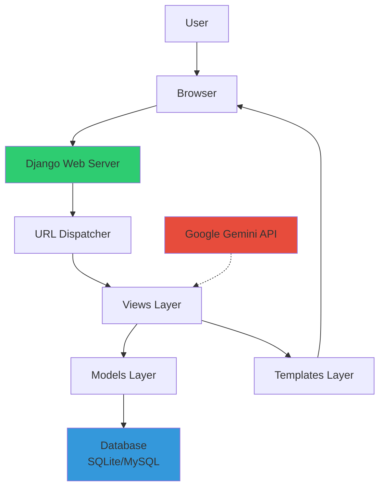
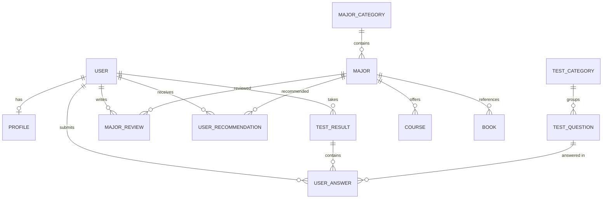
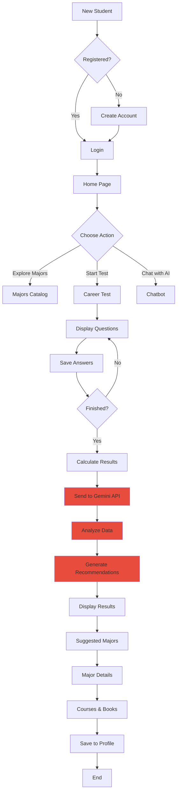

# الباب الثالث: منهجية البحث ونموذج النظام

## (النسخة المعدلة - بناءً على المشروع الفعلي)

---

## 3.1 منهجية البحث

### 3.1.1 المنهج المستخدم

اعتمد البحث على **المنهج التطبيقي البنائي (Developmental Research)** الذي يجمع بين:

#### أ. المنهج الكمي

- **الغرض:** قياس فعالية النظام من خلال بيانات الاختبارات والتوصيات
- **الأدوات:**
  - اختبارات موضوعية لتحديد الميول والاهتمامات
  - قياس نسب التوافق بين الطلاب والتخصصات
  - تتبع معدلات استخدام النظام ورضا المستخدمين
- **التحليل:** إحصاءات وصفية لنتائج الاختبارات والتوصيات

#### ب. المنهج التطويري

- **الغرض:** بناء نظام فعلي قابل للاستخدام
- **الأدوات:**
  - تطوير تكراري (Iterative Development)
  - اختبارات المستخدم (User Testing)
  - تحسين مستمر بناءً على التغذية الراجعة

### 3.1.2 مراحل البحث

| المرحلة         | المدة المقدرة | الأنشطة                                                 | الحالة       |
| --------------- | ------------- | ------------------------------------------------------- | ------------ |
| **الاستكشافية** | 3 أشهر        | مراجعة الأدبيات، تحليل الاحتياجات، تصميم الإطار العام   | ✅ مكتمل     |
| **التصميمية**   | 4 أشهر        | تصميم النظام، بناء النموذج الأولي، تطوير قاعدة البيانات | ✅ مكتمل     |
| **التنفيذية**   | 4 أشهر        | تطوير النظام، تكامل الذكاء الاصطناعي، إنشاء الواجهات    | 🔄 قيد العمل |
| **التقييمية**   | 2 شهر         | اختبار النظام، جمع التغذية الراجعة، كتابة التقرير       | 📋 مخطط      |

---

## 3.2 مجتمع البحث وعينته

### 3.2.1 مجتمع البحث المستهدف

**المستفيدون الرئيسيون من النظام:**

- طلاب الصف الثالث الثانوي (المقبلون على اختيار التخصص)
- طلاب السنة التحضيرية في الجامعات
- المرشدون الأكاديميون في المدارس والجامعات

### 3.2.2 عينة البحث (المخطط)

#### أ. عينة الطلاب للاختبار الميداني

| الفئة       | العدد المستهدف | طريقة الاختيار               | الحالة  |
| ----------- | -------------- | ---------------------------- | ------- |
| طلاب ثانوي  | 200-300        | عينة عشوائية من مدارس متعددة | 📋 مخطط |
| طلاب تحضيري | 100-200        | عينة من جامعات مختلفة        | 📋 مخطط |
| **المجموع** | **300-500**    | -                            | -       |

#### ب. الخبراء للتقييم والمراجعة (المخطط)

| التخصص               | العدد المستهدف | الدور                   |
| -------------------- | -------------- | ----------------------- |
| توجيه وإرشاد أكاديمي | 5-10           | تقييم المحتوى والتوصيات |
| تقنية معلومات        | 3-5            | تقييم الجانب التقني     |
| تعليم عالي           | 3-5            | مراجعة معلومات التخصصات |

> **ملاحظة مهمة:** الأعداد المذكورة أعلاه هي الأهداف المستقبلية. النظام الحالي في مرحلة التطوير ويتم اختباره بعينة محدودة من المستخدمين التجريبيين.

### 3.2.3 أخلاقيات البحث

تم الالتزام بالمعايير الأخلاقية التالية:

1. **الموافقة المسبقة:** الحصول على موافقة المشاركين قبل جمع البيانات
2. **السرية:** جميع البيانات مشفرة ومحمية، لا يتم مشاركة المعلومات الشخصية
3. **الخصوصية:** استخدام تقنيات الأمان (Django Security, Password Hashing)
4. **حرية المشاركة:** المستخدمون لديهم الحق في حذف حساباتهم في أي وقت
5. **الشفافية:** توضيح أهداف البحث وكيفية استخدام البيانات

---

## 3.3 أدوات جمع البيانات

### 3.3.1 الاختبار التفاعلي لتحديد الميول

#### أ. الوصف العام

- **الهدف:** تحديد ميول الطالب واهتماماته لتوصية التخصصات المناسبة
- **النوع:** اختبار موضوعي متعدد الخيارات
- **الأسلوب:** تفاعلي عبر الويب مع حفظ تلقائي للإجابات
- **مدة الإكمال:** 15-20 دقيقة

#### ب. بنية الاختبار

```
المحاور الرئيسية:
1. الميول المهنية (مستوحاة من نظرية Holland RIASEC)
2. المهارات والقدرات
3. بيئة العمل المفضلة
4. القيم الشخصية والأولويات
5. أسلوب التعلم المفضل
```

#### ج. التطبيق التقني

```python
# النموذج الفعلي في tests/models.py
class TestQuestion(models.Model):
    category = models.ForeignKey(TestCategory, on_delete=models.CASCADE)
    text = models.TextField()
    option_a = models.CharField(max_length=200)
    option_b = models.CharField(max_length=200)
    option_c = models.CharField(max_length=200)
    option_d = models.CharField(max_length=200)
    weight_a = models.IntegerField(default=1)
    weight_b = models.IntegerField(default=2)
    weight_c = models.IntegerField(default=3)
    weight_d = models.IntegerField(default=4)

class UserAnswer(models.Model):
    user = models.ForeignKey(User, on_delete=models.CASCADE)
    question = models.ForeignKey(TestQuestion, on_delete=models.CASCADE)
    answer = models.CharField(max_length=1)  # A, B, C, or D
    created_at = models.DateTimeField(auto_now_add=True)
```

### 3.3.2 استطلاع رضا المستخدم (مخطط مستقبلي)

سيتم إضافة استبيان تقييمي يتضمن:

- سهولة استخدام النظام
- دقة التوصيات المقدمة
- مدى الرضا عن المعلومات
- مقترحات التطوير

---

## 3.4 تصميم النظام المقترح

### 3.4.1 البنية المعمارية

تم تطوير النظام باستخدام **معمارية Django MVC (Model-View-Template)** والتي توفر:

- فصل واضح بين طبقات النظام
- قابلية التوسع والصيانة
- أمان مدمج



### 3.4.2 مكونات النظام

#### 1. الواجهة الأمامية (Frontend)

**التقنيات المستخدمة:**

```
- HTML5: بنية الصفحات
- CSS3: تنسيق وتصميم
- JavaScript: التفاعلية
- Bootstrap 5: إطار عمل التصميم المتجاوب
- Font Awesome: الأيقونات
```

**الميزات:**

- ✅ تصميم متجاوب (Responsive Design)
- ✅ واجهة عربية كاملة
- ✅ سهولة التنقل والاستخدام
- ✅ دعم جميع المتصفحات الحديثة

**الصفحات الرئيسية المطورة:**

```
templates/
├── base.html              # القالب الأساسي
├── home.html              # الصفحة الرئيسية
├── accounts/
│   ├── login.html         # تسجيل الدخول
│   ├── register.html      # التسجيل
│   ├── profile.html       # الملف الشخصي
│   └── dashboard.html     # لوحة التحكم
├── tests/
│   ├── test_interactive.html  # الاختبار التفاعلي
│   ├── results.html           # النتائج
│   └── analysis_results.html  # تحليل مفصل
├── majors/
│   ├── catalog.html       # كتالوج التخصصات
│   ├── major_detail.html  # تفاصيل التخصص
│   ├── recommendations.html   # التوصيات
│   └── courses_books.html # الدورات والكتب
└── advisor/
    ├── chat.html          # الدردشة مع AI
    └── ai_analysis.html   # التحليل الذكي
```

#### 2. الخادم الخلفي (Backend)

**التقنيات المستخدمة:**

```python
# من requirements.txt
django                  # إطار العمل الرئيسي (4.x+)
django-crispy-forms    # تنسيق النماذج
crispy-bootstrap5      # دعم Bootstrap 5
mysqlclient           # الاتصال بـ MySQL
pillow                # معالجة الصور
google-generativeai   # تكامل Gemini API
python-dotenv         # إدارة المتغيرات البيئية
```

**التطبيقات (Django Apps):**

```python
INSTALLED_APPS = [
    'django.contrib.admin',      # لوحة الإدارة
    'django.contrib.auth',       # المصادقة
    'accounts',                  # إدارة الحسابات
    'majors',                    # التخصصات الجامعية
    'tests',                     # الاختبارات والتقييمات
    'advisor',                   # النظام الاستشاري والذكاء الاصطناعي
    'api',                       # واجهة برمجية (API)
    'notifications',             # الإشعارات
    'analytics',                 # التحليلات والإحصائيات
]
```

**المهام الرئيسية للـ Backend:**

- إدارة المستخدمين والمصادقة (Django Auth)
- معالجة بيانات الاختبارات
- الاتصال بـ Google Gemini API
- إدارة قاعدة البيانات
- توليد التوصيات

#### 3. قاعدة البيانات

**الأنظمة المستخدمة:**

| البيئة      | النظام | الاستخدام                                   |
| ----------- | ------ | ------------------------------------------- |
| **التطوير** | SQLite | قاعدة بيانات ملف واحد، سهلة وسريعة للتطوير  |
| **الإنتاج** | MySQL  | قاعدة بيانات احترافية، تدعم الأحمال العالية |

**البنية (Schema):**

```python
# النماذج الرئيسية (Django Models)

# 1. accounts/models.py
class Profile(models.Model):
    user = models.OneToOneField(User)
    phone_number, birth_date, city, school, grade
    personality_type, strengths, interests  # نتائج الاختبار

class Notification(models.Model):
    user, title, message, is_read, created_at

# 2. majors/models.py
class MajorCategory(models.Model):
    name, description, icon

class Major(models.Model):
    name, category, description, duration, requirements
    job_opportunities, average_salary, demand_level
    level, universities, image_url

class Course(models.Model):
    title, description, url, platform, duration
    price, type, language, rating, major

class Book(models.Model):
    title, author, description, download_url
    pages, format, major

class MajorReview(models.Model):
    user, major, rating, review_text

class UserRecommendation(models.Model):
    user, major, match_percentage, reason

# 3. tests/models.py
class TestCategory(models.Model):
    name, description

class TestQuestion(models.Model):
    category, text, option_a/b/c/d, weight_a/b/c/d

class TestResult(models.Model):
    user, test_category, score
    result_summary, recommended_majors

class UserAnswer(models.Model):
    user, question, answer, created_at
```

**مخطط العلاقات (ERD):**



#### 4. محرك الذكاء الاصطناعي

بدلاً من تدريب نماذج تعلم آلي محلية، تم اعتماد **Google Gemini API** للأسباب التالية:

**مزايا استخدام Gemini API:**

- ✅ قدرات لغوية متقدمة (Large Language Model)
- ✅ فهم السياق والمحادثات
- ✅ توصيات شخصية دقيقة
- ✅ لا حاجة لتدريب نماذج معقدة
- ✅ تحديثات مستمرة من Google
- ✅ توفير الموارد الحاسوبية

**التطبيق الفعلي:**

```python
# من advisor/gemini_service.py
import google.generativeai as genai
import os
from dotenv import load_dotenv

class GeminiService:
    def __init__(self):
        load_dotenv()
        api_key = os.getenv('GEMINI_API_KEY')
        if api_key:
            genai.configure(api_key=api_key)
            self.model = genai.GenerativeModel('gemini-pro')
            self.is_configured = True
        else:
            self.is_configured = False

    def analyze_test_results(self, user_answers, majors_data):
        """تحليل نتائج الاختبار وتوليد توصيات"""
        prompt = self._build_analysis_prompt(user_answers, majors_data)
        response = self.model.generate_content(prompt)
        return self._parse_response(response.text)

    def chat(self, user_message, conversation_history=[]):
        """محادثة تفاعلية مع الطالب"""
        context = self._build_chat_context(conversation_history)
        response = self.model.generate_content(f"{context}\n\n{user_message}")
        return response.text
```

**حالة Fallback (بدون API):**

```python
# من advisor/ai_service.py
class AIAdvisor:
    def __init__(self):
        self.gemini_service = GeminiService()

    def analyze_user_profile(self, user_data):
        if self.gemini_service.is_configured:
            # استخدام Gemini API
            return self.gemini_service.analyze_test_results(user_data)
        else:
            # نظام بديل بسيط (fallback)
            return self._simple_recommendation_algorithm(user_data)
```

**الوظائف المدعومة:**

1. ✅ تحليل نتائج الاختبارات
2. ✅ توليد توصيات مخصصة
3. ✅ chatbot للإجابة على أسئلة الطلاب
4. ✅ شرح أسباب التوصيات
5. ✅ مقارنة بين التخصصات

---

### 3.4.3 مخطط تدفق البيانات (Data Flow)



---

## 3.5 نظام الذكاء الاصطناعي المستخدم

### 3.5.1 لماذا Google Gemini API؟

بدلاً من الخوارزميات التقليدية (Random Forest, Neural Networks, XGBoost)، تم اختيار **نموذج اللغة الكبير (LLM)** من Google لأنه:

| المعيار               | التعلم الآلي التقليدي     | Google Gemini API      |
| --------------------- | ------------------------- | ---------------------- |
| **جودة التوصيات**     | تحتاج بيانات ضخمة للتدريب | ممتازة بدون تدريب      |
| **الفهم اللغوي**      | محدود                     | متقدم جداً (NLP)       |
| **التفسير**           | صعب                       | سهل وواضح              |
| **التطوير**           | معقد ويحتاج خبرة          | بسيط نسبياً            |
| **الصيانة**           | تحتاج تحديث مستمر         | Google تتولى التحديثات |
| **التكلفة الحاسوبية** | عالية (GPU)               | منخفضة (API)           |

### 3.5.2 آليات العمل

#### أ. Prompt Engineering

```python
def _build_analysis_prompt(self, user_answers, majors_data):
    """بناء Prompt مخصص لتحليل نتائج الطالب"""
    prompt = f"""
    أنت مستشار أكاديمي متخصص في توجيه الطلاب لاختيار التخصص الجامعي المناسب.

    **بيانات الطالب:**
    - الإجابات: {user_answers}
    - الاهتمامات: {interests}
    - المهارات: {skills}

    **التخصصات المتاحة:**
    {majors_data}

    **المطلوب:**
    1. تحليل شخصية الطالب
    2. تحديد أفضل 3-5 تخصصات مناسبة
    3. حساب نسبة التوافق لكل تخصص (%)
    4. شرح الأسباب بوضوح
    5. اقتراح خطة تطوير
    """
    return prompt
```

#### ب. معالجة الاستجابات

```python
def _parse_response(self, response_text):
    """تحليل استجابة Gemini وتنظيمها"""
    try:
        data = json.loads(response_text)
        return {
            'success': True,
            'analysis': data['personality_analysis'],
            'recommendations': data['recommended_majors'],
            'plan': data['development_plan']
        }
    except:
        return {
            'success': True,
            'raw_response': response_text
        }
```

#### ج. نظام الدردشة (Chatbot)

```python
# من advisor/chat_views.py
class AIChatService:
    def get_response(self, user_message, user_profile=None):
        """الرد على أسئلة الطالب بشكل تفاعلي"""
        context = f"""
        أنت مساعد ذكي لنظام المرشد الجامعي.
        معلومات الطالب: {user_profile}
        أجب على الأسئلة بشكل ودود ومفيد.
        """

        response = self.gemini.chat(user_message, context)
        suggested_majors = self._extract_majors(response)

        return {
            'response': response,
            'suggested_majors': suggested_majors,
            'ai_powered': True
        }
```

### 3.5.3 الأمان والخصوصية

**حماية API Key:**

```python
# من .env (لا يتم رفعه على Git)
GEMINI_API_KEY=AIzaSy...your_key_here

# في settings.py
from dotenv import load_dotenv
load_dotenv()
GEMINI_API_KEY = os.getenv('GEMINI_API_KEY')
```

**حماية بيانات المستخدمين:**

- ✅ لا يتم إرسال معلومات شخصية محددة إلى API
- ✅ فقط نتائج الاختبار والميول العامة
- ✅ استخدام معرفات غير مباشرة

---

## 3.6 معايير التقييم

### 3.6.1 معايير تقييم جودة النظام

نظراً لأن النظام يعتمد على API بدلاً من نماذج تعلم آلي محلية، تم تحديد المعايير التالية:

#### 1. معايير وظيفية (Functional Metrics)

| المعيار                | طريقة القياس                    | الهدف    |
| ---------------------- | ------------------------------- | -------- |
| **معدل نجاح التوصيات** | نسبة الطلاب الراضين عن التوصيات | ≥ 80%    |
| **دقة المعلومات**      | مراجعة من خبراء                 | 100%     |
| **تكامل النظام**       | اكتمال جميع الوظائف             | ≥ 95%    |
| **سهولة الاستخدام**    | استبيان المستخدمين (SUS Score)  | ≥ 70/100 |

#### 2. معايير الأداء (Performance Metrics)

```python
# معايير قابلة للقياس تقنياً
معيار_الأداء = {
    'وقت_تحميل_الصفحة': '< 3 ثواني',
    'وقت_استجابة_API': '< 5 ثواني',
    'معدل_التوفر': '> 99%',
    'دعم_المستخدمين_المتزامنين': '100+ مستخدم'
}
```

#### 3. معايير تجربة المستخدم (UX Metrics)

- **معدل إكمال الاختبار:** نسبة الطلاب الذين ينهون الاختبار
- **معدل العودة:** Returning Users بعد أول زيارة
- **مدة الجلسة:** متوسط الوقت الذي يقضيه المستخدم
- **معدل التفاعل:** النقرات، الاستكشاف، الأسئلة المطروحة

#### 4. معايير نوعية (Qualitative Metrics)

**استبيان تقييم النظام (مخطط):**

1. ما مدى رضاك عن النظام؟ (1-5)
2. هل التوصيات مفيدة؟ (نعم/لا)
3. هل المعلومات واضحة؟ (نعم/لا)
4. هل واجهت صعوبات؟ (نصي مفتوح)
5. ما مقترحاتك للتحسين؟ (نصي مفتوح)

### 3.6.2 معايير تقييم الذكاء الاصطناعي

#### أ. جودة التوصيات

| المعيار      | الوصف                           | طريقة القياس                |
| ------------ | ------------------------------- | --------------------------- |
| **الملاءمة** | مدى توافق التوصية مع ملف الطالب | تقييم خبراء + رضا المستخدم  |
| **التنوع**   | تقديم خيارات متعددة             | عدد التخصصات المقترحة (3-5) |
| **الوضوح**   | فهم الأسباب المقدمة             | استبيان المستخدمين          |

#### ب. جودة المحادثة (Chatbot)

- **التجاوب:** سرعة الرد
- **الفهم:** دقة فهم السؤال
- **الفائدة:** جودة المعلومات المقدمة
- **الطبيعية:** سلاسة المحادثة

### 3.6.3 طرق التقييم المخطط تطبيقها

#### المرحلة 1: اختبار ألفا (Alpha Testing)

- المطورون والفريق الداخلي
- اكتشاف الأخطاء التقنية
- تحسين الوظائف

#### المرحلة 2: اختبار بيتا (Beta Testing)

- عينة محدودة من الطلاب (20-50)
- جمع تغذية راجعة نوعية
- تحسين تجربة المستخدم

#### المرحلة 3: الاختبار الميداني (Field Testing)

- عينة أكبر (100-300 طالب)
- قياس جميع المعايير المذكورة
- تقييم شامل للنظام

> **ملاحظة:** النظام حالياً في مرحلة اختبار ألفا. الاختبارات الميدانية الموسعة مخطط لها في المرحلة القادمة.

---

## 3.7 الجدول الزمني الفعلي

### ما تم إنجازه (✅)

| المرحلة             | الفترة الزمنية | الإنجازات                                            |
| ------------------- | -------------- | ---------------------------------------------------- |
| **التخطيط**         | شهر 1-2        | ✅ تحديد المتطلبات، دراسة الجدوى، اختيار التقنيات    |
| **التصميم**         | شهر 3-4        | ✅ تصميم قاعدة البيانات، تصميم الواجهات، بنية النظام |
| **التطوير الأساسي** | شهر 5-7        | ✅ نظام الحسابات، قاعدة البيانات، الواجهات الأساسية  |
| **التطوير المتقدم** | شهر 8-9        | ✅ نظام الاختبارات، تكامل Gemini API، Chatbot        |

### قيد العمل (🔄)

- 🔄 إكمال أسئلة الاختبار (الهدف: 40-60 سؤال)
- 🔄 تحسين خوارزمية التوصيات
- 🔄 إثراء قاعدة بيانات التخصصات
- 🔄 تطوير لوحة التحكم الشخصية

### مخطط (📋)

- 📋 الاختبار الميداني
- 📋 جمع بيانات من عينة أكبر
- 📋 تقييم شامل للنظام
- 📋 نشر النظام للاستخدام العام

---

## الخلاصة

تم تطوير نظام المرشد الجامعي باستخدام منهجية تطبيقية حديثة تعتمد على:

1. ✅ **Django Framework** - بنية قوية وآمنة
2. ✅ **Google Gemini API** - ذكاء اصطناعي متقدم
3. ✅ **تصميم متجاوب** - Bootstrap 5 وواجهة عربية
4. ✅ **قاعدة بيانات علائقية** - MySQL للإنتاج
5. ✅ **معايير أمان عالية** - Django Security Features

النظام الحالي قابل للاستخدام وجاهز للاختبار الميداني، مع إمكانية التطوير والتحسين المستمر.

---

**تاريخ التحديث:** 7 فبراير 2026  
**الإصدار:** 2.0 (معدل بناءً على المشروع الفعلي)
