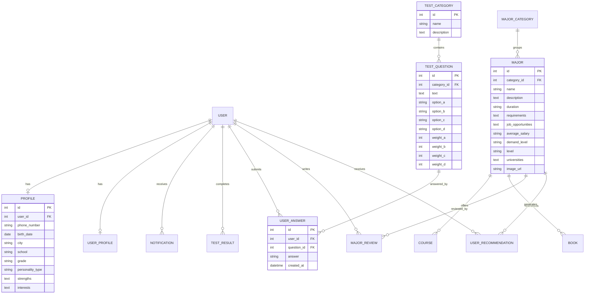

# الباب الرابع: التصميم والتنفيذ

## (النسخة المعدلة - بناءً على المشروع الفعلي)

---

## 4.1 تصميم قاعدة البيانات

### 4.1.1 نظرة عامة

تم تصميم قاعدة البيانات باستخدام **Django ORM** الذي يوفر طبقة تجريد عالية المستوى للتعامل مع قواعد البيانات العلائقية. يدعم النظام قاعدتي بيانات:

- **SQLite**: للتطوير والاختبار السريع
- **MySQL**: للبيئة الإنتاجية

### 4.1.2 المخطط العلائقي (ER Diagram)



### 4.1.3 الجداول التفصيلية

#### 1. جدول المستخدمين (Django Auth User)

Django يوفر نموذج مستخدم جاهز يتضمن:

```python
# Django Built-in User Model
class User:
    id: AutoField (Primary Key)
    username: CharField (unique)
    email: EmailField
    password: CharField (hashed)
    first_name: CharField
    last_name: CharField
    is_active: BooleanField
    is_staff: BooleanField
    is_superuser: BooleanField
    date_joined: DateTimeField
    last_login: DateTimeField
```

#### 2. جدول الملف الشخصي (Profile)

```python
# من accounts/models.py
class Profile(models.Model):
    user = models.OneToOneField(User, on_delete=models.CASCADE)
    phone_number = models.CharField(max_length=15, blank=True)
    birth_date = models.DateField(null=True, blank=True)
    city = models.CharField(max_length=100, blank=True)
    school = models.CharField(max_length=200, blank=True)
    grade = models.CharField(max_length=50, blank=True)

    # نتائج الاختبار
    personality_type = models.CharField(max_length=50, blank=True)
    strengths = models.TextField(blank=True)
    interests = models.TextField(blank=True)

    created_at = models.DateTimeField(auto_now_add=True)
    updated_at = models.DateTimeField(auto_now=True)
```

**SQL المكافئ:**

```sql
CREATE TABLE accounts_profile (
    id INT PRIMARY KEY AUTO_INCREMENT,
    user_id INT UNIQUE NOT NULL,
    phone_number VARCHAR(15),
    birth_date DATE,
    city VARCHAR(100),
    school VARCHAR(200),
    grade VARCHAR(50),
    personality_type VARCHAR(50),
    strengths TEXT,
    interests TEXT,
    created_at TIMESTAMP DEFAULT CURRENT_TIMESTAMP,
    updated_at TIMESTAMP DEFAULT CURRENT_TIMESTAMP ON UPDATE CURRENT_TIMESTAMP,
    FOREIGN KEY (user_id) REFERENCES auth_user(id) ON DELETE CASCADE
);
```

#### 3. جدول فئات التخصصات (MajorCategory)

```python
# من majors/models.py
class MajorCategory(models.Model):
    name = models.CharField(max_length=100)
    description = models.TextField(blank=True, null=True)
    icon = models.CharField(max_length=50, default='fas fa-folder')

    class Meta:
        db_table = 'majors_majorcategory'
```

**SQL المكافئ:**

```sql
CREATE TABLE majors_majorcategory (
    id INT PRIMARY KEY AUTO_INCREMENT,
    name VARCHAR(100) NOT NULL,
    description TEXT,
    icon VARCHAR(50) DEFAULT 'fas fa-folder',
    INDEX idx_name (name)
);
```

#### 4. جدول التخصصات (Major)

```python
# من majors/models.py
class Major(models.Model):
    LEVEL_CHOICES = [
        ('bachelor', 'بكالوريوس'),
        ('master', 'ماجستير'),
        ('phd', 'دكتوراه'),
    ]

    name = models.CharField(max_length=200)
    category = models.ForeignKey(MajorCategory, on_delete=models.CASCADE)
    description = models.TextField()
    duration = models.CharField(max_length=50)
    requirements = models.TextField(blank=True, null=True)
    job_opportunities = models.TextField()
    average_salary = models.CharField(max_length=100)
    demand_level = models.CharField(max_length=50)
    level = models.CharField(max_length=20, choices=LEVEL_CHOICES)
    universities = models.TextField(blank=True, null=True)
    image_url = models.URLField(blank=True, null=True)
    created_at = models.DateTimeField(auto_now_add=True)
```

**SQL المكافئ:**

```sql
CREATE TABLE majors_major (
    id INT PRIMARY KEY AUTO_INCREMENT,
    name VARCHAR(200) NOT NULL,
    category_id INT NOT NULL,
    description TEXT NOT NULL,
    duration VARCHAR(50),
    requirements TEXT,
    job_opportunities TEXT,
    average_salary VARCHAR(100),
    demand_level VARCHAR(50),
    level VARCHAR(20),
    universities TEXT,
    image_url VARCHAR(200),
    created_at TIMESTAMP DEFAULT CURRENT_TIMESTAMP,
    FOREIGN KEY (category_id) REFERENCES majors_majorcategory(id),
    INDEX idx_category (category_id),
    INDEX idx_demand (demand_level),
    FULLTEXT idx_search (name, description)
);
```

#### 5. جدول الاختبارات (TestQuestion)

```python
# من tests/models.py
class TestQuestion(models.Model):
    category = models.ForeignKey(TestCategory, on_delete=models.CASCADE)
    text = models.TextField()
    option_a = models.CharField(max_length=200)
    option_b = models.CharField(max_length=200)
    option_c = models.CharField(max_length=200)
    option_d = models.CharField(max_length=200)
    weight_a = models.IntegerField(default=1)
    weight_b = models.IntegerField(default=2)
    weight_c = models.IntegerField(default=3)
    weight_d = models.IntegerField(default=4)
```

**SQL المكافئ:**

```sql
CREATE TABLE tests_testquestion (
    id INT PRIMARY KEY AUTO_INCREMENT,
    category_id INT NOT NULL,
    text TEXT NOT NULL,
    option_a VARCHAR(200),
    option_b VARCHAR(200),
    option_c VARCHAR(200),
    option_d VARCHAR(200),
    weight_a INT DEFAULT 1,
    weight_b INT DEFAULT 2,
    weight_c INT DEFAULT 3,
    weight_d INT DEFAULT 4,
    FOREIGN KEY (category_id) REFERENCES tests_testcategory(id),
    INDEX idx_category (category_id)
);
```

#### 6. جدول التوصيات (UserRecommendation)

```python
# من majors/models.py
class UserRecommendation(models.Model):
    user = models.ForeignKey(User, on_delete=models.CASCADE)
    major = models.ForeignKey(Major, on_delete=models.CASCADE)
    match_percentage = models.DecimalField(max_digits=5, decimal_places=2)
    reason = models.TextField()
    created_at = models.DateTimeField(auto_now_add=True)

    class Meta:
        ordering = ['-match_percentage']
```

**SQL المكافئ:**

```sql
CREATE TABLE majors_userrecommendation (
    id INT PRIMARY KEY AUTO_INCREMENT,
    user_id INT NOT NULL,
    major_id INT NOT NULL,
    match_percentage DECIMAL(5,2) NOT NULL,
    reason TEXT,
    created_at TIMESTAMP DEFAULT CURRENT_TIMESTAMP,
    FOREIGN KEY (user_id) REFERENCES auth_user(id) ON DELETE CASCADE,
    FOREIGN KEY (major_id) REFERENCES majors_major(id) ON DELETE CASCADE,
    INDEX idx_user (user_id),
    INDEX idx_match (match_percentage DESC)
);
```

### 4.1.4 العلاقات بين الجداول

| العلاقة                    | النوع       | الوصف                      |
| -------------------------- | ----------- | -------------------------- |
| User → Profile             | One-to-One  | كل مستخدم له ملف شخصي واحد |
| User → UserAnswer          | One-to-Many | مستخدم واحد له عدة إجابات  |
| TestQuestion → UserAnswer  | One-to-Many | سؤال واحد له عدة إجابات    |
| MajorCategory → Major      | One-to-Many | فئة واحدة تحتوي عدة تخصصات |
| Major → Course             | One-to-Many | تخصص واحد له عدة دورات     |
| Major → Book               | One-to-Many | تخصص واحد له عدة كتب       |
| User → UserRecommendation  | One-to-Many | مستخدم واحد له عدة توصيات  |
| Major → UserRecommendation | One-to-Many | تخصص واحد في عدة توصيات    |

---

## 4.2 تصميم واجهة المستخدم

### 4.2.1 نظام التصميم

تم اعتماد **Bootstrap 5** كإطار عمل رئيسي مع تخصيصات عربية:

**الألوان الرئيسية:**

```css
:root {
  --primary-color: #2ecc71; /* أخضر */
  --secondary-color: #3498db; /* أزرق */
  --accent-color: #e74c3c; /* أحمر */
  --dark-color: #2c3e50; /* رمادي داكن */
  --light-color: #ecf0f1; /* رمادي فاتح */
}
```

**الخطوط:**

```css
body {
  font-family: "Cairo", "Arial", sans-serif;
  direction: rtl;
  text-align: right;
}
```

### 4.2.2 الصفحات الرئيسية

#### 1. الصفحة الرئيسية (home.html)

**المكونات:**

- شريط التنقل (Navbar)
- قسم البطل (Hero Section)
- نبذة عن النظام
- روابط سريعة للاختبار والتخصصات
- تذييل الصفحة (Footer)

**الكود الأساسي:**

```html
 
<section class="hero-section">
  <div class="container">
    <h1>نظام المرشد الجامعي</h1>
    <p>اكتشف التخصص المناسب لك</p>
    <a href="" class="btn btn-primary"> ابدأ الاختبار </a>
  </div>
</section>

<section class="features">
  <div class="container">
    <div class="row">
      <div class="col-md-4">
        <i class="fas fa-chart-line"></i>
        <h3>تحليل دقيق</h3>
        <p>تحليل شامل لشخصيتك وميولك</p>
      </div>
      <!-- المزيد من الميزات -->
    </div>
  </div>
</section>

```

#### 2. صفحة الاختبار (test_interactive.html)

**المكونات:**

- شريط التقدم
- عرض السؤال
- خيارات الإجابة (A, B, C, D)
- أزرار التنقل (التالي/السابق)
- حفظ تلقائي

**الكود الأساسي:**

```html
 
<div class="test-container">
  <div class="progress-bar">
    <div class="progress-fill" style="width: {{ progress }}%"></div>
    <span>{{ current_question }}/{{ total_questions }}</span>
  </div>

  <div class="question-card">
    <h3>{{ question.text }}</h3>

    <div class="options">
      <button class="option-btn" data-value="A">{{ question.option_a }}</button>
      <button class="option-btn" data-value="B">{{ question.option_b }}</button>
      <button class="option-btn" data-value="C">{{ question.option_c }}</button>
      <button class="option-btn" data-value="D">{{ question.option_d }}</button>
    </div>
  </div>

  <div class="navigation">
    <button id="prev-btn">السابق</button>
    <button id="next-btn">التالي</button>
  </div>
</div>

<script>
  // حفظ الإجابة تلقائياً
  document.querySelectorAll('.option-btn').forEach(btn => {
      btn.addEventListener('click', function() {
          const answer = this.dataset.value;
          saveAnswer({{ question.id }}, answer);
      });
  });

  function saveAnswer(questionId, answer) {
      fetch('/api/save-answer/', {
          method: 'POST',
          headers: {
              'Content-Type': 'application/json',
              'X-CSRFToken': '{{ csrf_token }}'
          },
          body: JSON.stringify({
              question_id: questionId,
              answer: answer
          })
      });
  }
</script>

```

#### 3. صفحة النتائج (results.html)

**المكونات:**

- تحليل الشخصية
- التخصصات الموصى بها (مرتبة)
- نسبة التوافق لكل تخصص
- أسباب التوصية
- روابط لتفاصيل التخصصات

**الكود الأساسي:**

```html
 
<div class="results-container">
  <h2>نتائج الاختبار</h2>

  <div class="personality-analysis">
    <h3>تحليل الشخصية</h3>
    <p>{{ personality_analysis }}</p>
  </div>

  <div class="recommendations">
    <h3>التخصصات الموصى بها</h3>

    
    <div class="recommendation-card">
      <div class="rank-badge">#{{ forloop.counter }}</div>
      <h4>{{ rec.major.name }}</h4>

      <div class="match-percentage">
        <div class="circular-progress">
          <span>{{ rec.match_percentage }}%</span>
        </div>
        <p>نسبة التوافق</p>
      </div>

      <div class="reasons">
        <h5>أسباب التوصية:</h5>
        <p>{{ rec.reason }}</p>
      </div>

      <a href="" class="btn btn-primary">
        استكشاف التخصص
      </a>
    </div>
    
  </div>
</div>

```

### 4.2.3 عناصر واجهة المستخدم الرئيسية

#### شريط التقدم (Progress Bar)

```html
<div class="progress-container">
  <div class="progress-bar">
    <div class="progress-fill" id="progressFill"></div>
  </div>
  <span class="progress-text" id="progressText">0% مكتمل</span>
</div>

<style>
  .progress-container {
    width: 100%;
    margin: 20px 0;
  }

  .progress-bar {
    width: 100%;
    height: 30px;
    background-color: #ecf0f1;
    border-radius: 15px;
    overflow: hidden;
  }

  .progress-fill {
    height: 100%;
    background: linear-gradient(90deg, #2ecc71, #27ae60);
    transition: width 0.3s ease;
  }
</style>

<script>
  function updateProgress(current, total) {
    const percentage = (current / total) * 100;
    document.getElementById("progressFill").style.width = percentage + "%";
    document.getElementById("progressText").textContent =
      Math.round(percentage) + "% مكتمل";
  }
</script>
```

#### بطاقة التوصية (Recommendation Card)

```html
<div class="recommendation-card">
  <div class="card-header">
    <span class="rank-badge">#1</span>
    <h4>علوم الحاسب</h4>
  </div>

  <div class="card-body">
    <div class="match-info">
      <div class="circular-progress" data-percentage="92">
        <svg class="progress-ring" width="120" height="120">
          <circle
            class="progress-ring-circle"
            stroke="#2ecc71"
            stroke-width="4"
            fill="transparent"
            r="52"
            cx="60"
            cy="60"
          />
        </svg>
        <span class="percentage-text">92%</span>
      </div>
      <p>نسبة التوافق</p>
    </div>

    <div class="reasons-list">
      <h5>أسباب التوصية:</h5>
      <ul>
        <li>تتوافق مع ميولك التحليلية</li>
        <li>لديك مهارات قوية في الرياضيات</li>
        <li>مجال واعد بفرص عمل كثيرة</li>
      </ul>
    </div>
  </div>

  <div class="card-footer">
    <button class="btn btn-explore">استكشاف التخصص</button>
  </div>
</div>

<style>
  .recommendation-card {
    background: white;
    border-radius: 10px;
    box-shadow: 0 2px 10px rgba(0, 0, 0, 0.1);
    padding: 20px;
    margin: 15px 0;
  }

  .rank-badge {
    background: linear-gradient(135deg, #667eea 0%, #764ba2 100%);
    color: white;
    padding: 5px 15px;
    border-radius: 20px;
    font-weight: bold;
  }

  .circular-progress {
    position: relative;
    width: 120px;
    height: 120px;
  }

  .percentage-text {
    position: absolute;
    top: 50%;
    left: 50%;
    transform: translate(-50%, -50%);
    font-size: 24px;
    font-weight: bold;
    color: #2ecc71;
  }
</style>
```

### 4.2.4 التصميم المتجاوب (Responsive Design)

تم تصميم النظام ليعمل على جميع الأجهزة:

```css
/* الهواتف المحمولة (< 768px) */
@media (max-width: 767px) {
  .container {
    padding: 10px;
  }

  .recommendation-card {
    margin: 10px 0;
  }

  .hero-section h1 {
    font-size: 24px;
  }
}

/* الأجهزة اللوحية (768px - 1023px) */
@media (min-width: 768px) and (max-width: 1023px) {
  .container {
    max-width: 720px;
  }

  .col-md-4 {
    width: 50%;
  }
}

/* الحواسيب المكتبية (≥ 1024px) */
@media (min-width: 1024px) {
  .container {
    max-width: 1140px;
  }
}
```

### 4.2.5 إمكانية الوصول (Accessibility)

**ARIA Labels:**

```html
<button aria-label="بدء الاختبار" class="btn-start">ابدأ الآن</button>

<nav aria-label="التنقل الرئيسي">
  <ul>
    <li><a href="/">الرئيسية</a></li>
    <li><a href="/majors/">التخصصات</a></li>
  </ul>
</nav>
```

**التباين اللوني:**

- نسبة تباين لا تقل عن 4.5:1 للنصوص العادية
- نسبة 3:1 للعناصر الكبيرة

**دعم لوحة المفاتيح:**

```javascript
// التنقل بين الأسئلة بالأسهم
document.addEventListener("keydown", function (e) {
  if (e.key === "ArrowLeft") {
    document.getElementById("prev-btn").click();
  } else if (e.key === "ArrowRight") {
    document.getElementById("next-btn").click();
  }
});
```

---

## 4.3 تنفيذ نظام الذكاء الاصطناعي

### 4.3.1 تكامل Google Gemini API

**الإعداد الأولي:**

```python
# من advisor/gemini_service.py
import google.generativeai as genai
import os
from dotenv import load_dotenv

class GeminiService:
    def __init__(self):
        load_dotenv()
        api_key = os.getenv('GEMINI_API_KEY')

        if api_key and api_key != 'your_api_key_here':
            try:
                genai.configure(api_key=api_key)
                self.model = genai.GenerativeModel('gemini-pro')
                self.is_configured = True
            except Exception as e:
                print(f"خطأ في تكوين Gemini: {e}")
                self.is_configured = False
        else:
            self.is_configured = False
```

**توليد التوصيات:**

```python
def analyze_test_results(self, user_answers, majors_data):
    """
    تحليل نتائج الاختبار وإنشاء توصيات
    """
    if not self.is_configured:
        return self._fallback_recommendations(user_answers, majors_data)

    prompt = self._build_analysis_prompt(user_answers, majors_data)

    try:
        response = self.model.generate_content(prompt)
        return self._parse_response(response.text)
    except Exception as e:
        print(f"خطأ في Gemini API: {e}")
        return self._fallback_recommendations(user_answers, majors_data)

def _build_analysis_prompt(self, user_answers, majors_data):
    """
    بناء Prompt مخصص
    """
    prompt = f"""
    أنت مستشار أكاديمي متخصص في توجيه الطلاب.

    **بيانات الطالب:**
    {user_answers}

    **التخصصات المتاحة:**
    {majors_data}

    **المطلوب:**
    حلل إجابات الطالب واقترح أفضل 5 تخصصات مناسبة مع:
    1. نسبة التوافق (%)
    2. الأسباب المنطقية
    3. نقاط القوة التي تتوافق مع كل تخصص

    أعد النتيجة بصيغة JSON:
    {{
        "personality_type": "...",
        "recommendations": [
            {{
                "major_name": "...",
                "match_percentage": 90,
                "reasons": ["...", "..."],
                "strengths": ["...", "..."]
            }}
        ]
    }}
    """
    return prompt
```

### 4.3.2 نظام Fallback (بدون API)

```python
def _fallback_recommendations(self, user_answers, majors_data):
    """
    نظام بديل بسيط عند عدم توفر Gemini API
    """
    # حساب بسيط بناءً على الأوزان
    scores = {}

    for answer in user_answers:
        question = answer.question
        weight = getattr(question, f'weight_{answer.answer.lower()}')

        # ربط الفئات بالتخصصات
        related_majors = self._get_related_majors(question.category)
        for major in related_majors:
            if major.id not in scores:
                scores[major.id] = 0
            scores[major.id] += weight

    # ترتيب التخصصات
    sorted_majors = sorted(scores.items(), key=lambda x: x[1], reverse=True)

    recommendations = []
    for major_id, score in sorted_majors[:5]:
        major = Major.objects.get(id=major_id)
        match_percentage = min((score / len(user_answers)) * 100, 100)

        recommendations.append({
            'major': major,
            'match_percentage': round(match_percentage, 2),
            'reason': f'تتوافق مع {match_percentage:.0f}% من إجاباتك'
        })

    return recommendations
```

---

## 4.4 التنفيذ والنشر

### 4.4.1 البنية التحتية المستخدمة

```
Django Application
├── Development Environment
│   ├── SQLite Database
│   ├── Django Dev Server (runserver)
│   └── Local Testing
│
└── Production Environment (مخطط)
    ├── MySQL Database
    ├── Gunicorn WSGI Server
    ├── Nginx Web Server
    └── Cloud Hosting (AWS/DigitalOcean)
```

### 4.4.2 إعدادات قاعدة البيانات

**للتطوير (SQLite):**

```python
DATABASES = {
    'default': {
        'ENGINE': 'django.db.backends.sqlite3',
        'NAME': BASE_DIR / 'db.sqlite3',
    }
}
```

**للإنتاج (MySQL):**

```python
DATABASES = {
    'default': {
        'ENGINE': 'django.db.backends.mysql',
        'NAME': 'university_advisor',
        'USER': 'root',
        'PASSWORD': 'your_password',
        'HOST': 'localhost',
        'PORT': '3306',
        'OPTIONS': {
            'charset': 'utf8mb4',
        }
    }
}
```

### 4.4.3 الأمان

**حماية CSRF:**

```html
<form method="post">
  
  <!-- الحقول -->
</form>
```

**تشفير كلمات المرور:**

```python
# Django يقوم بذلك تلقائياً
from django.contrib.auth.hashers import make_password

password_hash = make_password('user_password')
```

**المصادقة:**

```python
from django.contrib.auth.decorators import login_required

@login_required
def profile_view(request):
    return render(request, 'profile.html')
```

### 4.4.4 الاختبار

**اختبارات الوحدة:**

```python
# من tests/tests.py
from django.test import TestCase
from tests.models import TestQuestion

class TestQuestionModelTest(TestCase):
    def setUp(self):
        self.category = TestCategory.objects.create(
            name="اختبار",
            description="وصف"
        )

    def test_create_question(self):
        question = TestQuestion.objects.create(
            category=self.category,
            text="ما هو لونك المفضل؟",
            option_a="أحمر",
            option_b="أزرق",
            option_c="أخضر",
            option_d="أصفر"
        )
        self.assertEqual(question.text, "ما هو لونك المفضل؟")
        self.assertEqual(question.weight_a, 1)
```

---

## الخلاصة

تم تطوير النظام باستخدام:

1. ✅ **Django Framework** - بنية قوية ومنظمة
2. ✅ **Bootstrap 5** - تصميم متجاوب وعصري
3. ✅ **Google Gemini API** - ذكاء اصطناعي متقدم
4. ✅ **SQLite/MySQL** - قواعد بيانات مرنة
5. ✅ **Django Templates** - نظام قوالب فعال

النظام جاهز للاستخدام والتطوير المستمر.

---

**تاريخ التحديث:** 7 فبراير 2026  
**الإصدار:** 2.0 (معدل بناءً على المشروع الفعلي)
